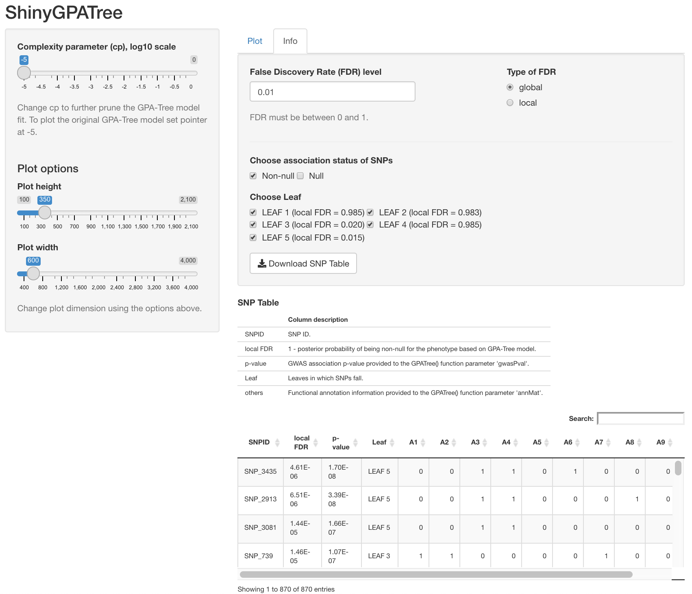

```{r, include = FALSE}
knitr::opts_chunk$set(
  collapse = TRUE,
  # tidy = TRUE,
  prompt = TRUE,
  # split=TRUE,
  # tidy = TRUE,
  comment = ""
)
```
# Overview
<!-- \section{Overview} -->

This vignette provides an introduction to the \texttt{GPATree} package. R package \texttt{GPATree} implements GPA-Tree, a novel statistical approach to prioritize genome-wide association studies (GWAS) results while simultaneously identifying the combinations of functional annotations associated with risk-associated genetic variants. GPA-Tree integrates GWAS summary statistics and functional annotation data within a unified framework, by combining a decision tree algorithm (CART)[@breiman1984classification] within the hierarchical model.

The package can be loaded with the command:


```{r setup, include=TRUE, message=FALSE, warning=FALSE}
library(GPATree)
```
```{r,eval=TRUE, include=FALSE, echo = FALSE}
options(digits = 4)
```
This vignette is organized as follows. Sections \ref{fitting} and \ref{shiny} illustrate the recommended \texttt{GPATree-ShinyGPATree} workflow, which provides convenient and interactive genetic data analysis interface. Advanced users might also find Sections \ref{pruning} – \ref{association} useful as the command lines can be used for integrating GPA-Tree as part of the more comprehensive genetic data analysis workflow, for example.

Please feel free to contact Dongjun Chung at \texttt{chung.911@osu.edu} for any questions or suggestions regarding the `\texttt{GPATree}' package.

# Workflow
<!-- \section{Workflow}\label{workflow} -->

In this vignette, we illustrate the GPA-Tree analysis workflow, using the simulated data provided as the  \texttt{GPATreeExampleData} in the \texttt{GPATree} package. In the simulated data, the number of SNPs is set to $M=10,000$ and the number of functional annotations is set to $K=10$. The GWAS association  $p$-values and the binary functional annotation information are stored in \texttt{GPATreeExampleData\$gwasPval} and \texttt{GPATreeExampleData\$annMat}, respectively. The number of rows in \texttt{GPATreeExampleData\$gwasPval} is assumed to be the same as the number of rows in \texttt{GPATreeExampleData\$annMat}, where the $i$-th ($i=1,...,M$) row of \texttt{gwasPval} and \texttt{annMat} correspond to the same SNP.


```{r include=TRUE, message=FALSE, warning=FALSE, split=TRUE}
data(GPATreeExampleData)
dim(GPATreeExampleData$gwasPval)
head(GPATreeExampleData$gwasPval)
dim(GPATreeExampleData$annMat)
head(GPATreeExampleData$annMat)
```
<!-- \subsection{Fitting the GPA-Tree Model}\label{fitting} -->
## Fitting the GPA-Tree Model \label{fitting}

We can fit the GPA-Tree model using the GWAS association $p$-values (\texttt{GPATreeExampleData\$gwasPval}) and functional annotation data (\texttt{GPATreeExampleData\$annMat}) described above, using the code shown below.

```{r GPATree, eval=TRUE, include=TRUE, message=FALSE, warning=FALSE, message=FALSE}
fit.GPATree <- GPATree(gwasPval = GPATreeExampleData$gwasPval,
                       annMat = GPATreeExampleData$annMat,
                       initAlpha = 0.1,
                       cpTry = 0.005)
```
```{r, eval=TRUE, include=FALSE, echo = FALSE}
options(digits = 4)
```
```{r, eval=TRUE, include=TRUE, message=FALSE, warning=FALSE}
fit.GPATree
```


<!-- \subsection{ShinyGPATree}\label{shiny} -->

## ShinyGPATree \label{shiny}

The following command can be used to initialize the ShinyGPATree app. ShinyGPATree allows for interactive and dynamic investigation of disease-risk-associated SNPs and functional annotation trees using R Shiny.

```{r, eval=FALSE, include=TRUE, message=FALSE, warning=FALSE, tidy=TRUE, comment=""}
ShinyGPATree(fit.GPATree)
```
Figure 1 shows the layout of the ShinyGPATree app, where the ‘Plot’ tab opens by default. The summary statistics displayed in the plot are automatically updated as the user input option for cp (in the log10 scale) on the left panel of the screen is modified. Users can also improve visualization of the functional annotation tree plot using the plot width and height options on the left panel. The `Download Plot’ button on the top allows users to download the functional annotation tree plot as a Portable Network Graphics (png) format file. Finally, a table titled ‘Leaf Description’ underneath the plot characterizes the functional annotations that are 0 or 1 for SNPs in specific leaves.

```{r, echo=FALSE, out.height="100%", out.width="100%", fig.cap="Screenshot of the ShinyGPATree app with the `Plot' tab open."}
knitr::include_graphics("plot_tab.png")
```

As seen in Figure 2, the 'Info’ tab in the ShinyGPATree app opens the user interface for association mapping and functional annotation characterization for SNPs. Under this tab, users can find more information on specific SNPs driving the visualization. At the top of the panel, user input options for FDR level and FDR type (global vs. local) are located, followed by options to select SNPs that fall on specific leaves of the GPA-Tree model or have specific association status (non-risk-associated vs. risk-associated SNPs). The `SNP Table’ at the bottom of the ‘Info’ tab panel shows information for SNPs that satisfy all user-specified input options. Each row of the table represents a SNP and includes its ID, local FDR value, GWAS association p-value, the leaf in which it is located, and its complete functional annotation information. The ‘Download SNP Table’ button allows users to download the ‘SNP Table’ as a Microsoft Excel comma separated values (CSV) file format.

```{r, echo=FALSE, out.height="100%", out.width="100%", fig.cap="Screenshot of the ShinyGPATree app with the `Info' tab open."}

```

## Advanced use \label{advuse}
### Prunning GPA-Tree model fit \label{pruning}

The \texttt{prune()} function will prune the GPA-Tree model using any cp value between 0 and 1 as shown below.

```{r, eval=TRUE, include=TRUE, message=FALSE, warning=FALSE}
fit.GPATree.pruned <- prune(fit.GPATree, cp = 0.3)
fit.GPATree.pruned
```

<!-- \subsection{Functional annotation tree}\label{annotation} -->
### Functional annotation tree \label{annotation}
The \texttt{plot()} and \texttt{leaf()} functions will plot the GPA-Tree functional annotation tree and provide information about the leaves (terminal nodes) in the tree as shown below.

```{r, eval=TRUE, include=TRUE, message=FALSE, warning=FALSE}
plot(fit.GPATree)
```

```{r, eval=TRUE, include=TRUE, message=FALSE, warning=FALSE}
leaf(fit.GPATree)
```

<!-- # ```{r, eval=TRUE, include=TRUE, message=FALSE, warning=FALSE} -->
<!-- # plot(fit.GPATree.pruned) -->
<!-- # ``` -->
<!-- #  -->
<!-- # ```{r, eval=TRUE, include=TRUE, message=FALSE, warning=FALSE} -->
<!-- # leaf(fit.GPATree.pruned) -->
<!-- # ``` -->

<!-- \subsection{Association mapping}\label{association} -->
### Association mapping\label{association}

For the fitted GPA-Tree model, we can make inferences about SNPs using the \texttt{assoc()} function by: $(1)$ prioritizing risk-associated SNPs, and (2) identifying the leaves of the GPA-Tree model in which the risk-associated SNPs are located. The \texttt{assoc()} function returns two columns. The first column contains binary values where 1 indicates that the SNP is associated with the trait and 0 indicates otherwise. The second column provides information regarding the leaf in which the SNP is located in the GPA-Tree plot. The \texttt{assoc()} function allows both local (\texttt{fdrControl="local"}) and global FDR controls (\texttt{fdrControl="global"}) and users can set the threshold to be between 0 and 1 using the `\texttt{FDR}' argument. For \texttt{GPATreeExampleData}, GPA-Tree model identified $870$ risk SNPs at the nominal global FDR level of $0.01$. 371 and 499 of the 870 risk-associated SNPs are located in leaf 3 and leaf 5, respectively. The following lines of code can be used to investigate association mapping and functional annotation tree.

```{r, eval=TRUE, include=TRUE, message=FALSE, warning=FALSE}
assoc.SNP.GPATree <- assoc(fit.GPATree, 
                           FDR = 0.01, 
                           fdrControl="global")
head(assoc.SNP.GPATree)
table(assoc.SNP.GPATree$P1)
table(assoc.SNP.GPATree$leaf)
table(assoc.SNP.GPATree$P1, assoc.SNP.GPATree$leaf)
```


# References

